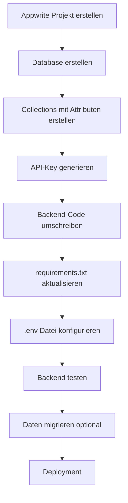

# Migrationsplan: MongoDB zu Appwrite

## Übersicht

Die WGorganiser App soll von MongoDB (mit Motor async driver) auf **Appwrite Cloud** umgestellt werden. Appwrite bietet eine Backend-as-a-Service Lösung mit PostgreSQL-basierter Datenbank.

## Aktuelle Struktur

### Datenmodelle (MongoDB Collections)

| Collection | Beschreibung | Felder |
|------------|--------------|--------|
| `stays` | Aufenthalte | id, room, occupant_name, start_date, end_date, notes, checklist_in, checklist_out, created_at, updated_at |
| `manuals` | Bedienungsanleitungen | id, title, description, steps, image_url, image_data, created_at, updated_at |
| `messages` | Chat-Nachrichten | id, name, content, created_at, replies[] |
| `events` | Veranstaltungen | id, title, date, location, description, hashtags[], created_at |
| `berlin_links` | Berlin-Links | id, url, description, hashtags[], created_at |
| `settings` | Einstellungen | id, rooms[], checkin_template[], checkout_template[], updated_at |

## Appwrite-Konfiguration

### Benötigte Appwrite-Ressourcen

1. **Project** erstellen in cloud.appwrite.io
2. **Database** erstellen (z.B. `wg-organiser`)
3. **Collections** erstellen mit folgenden Attributen:

### Collection: stays
```
- id: string (required, unique)
- room: string (required)
- occupant_name: string (required)
- start_date: string (required)
- end_date: string (required)
- notes: string (optional)
- checklist_in: string (JSON-serialisiert)
- checklist_out: string (JSON-serialisiert)
- created_at: string
- updated_at: string
```

### Collection: manuals
```
- id: string (required, unique)
- title: string (required)
- description: string (required)
- steps: string (required)
- image_url: string (optional)
- image_data: string (optional, Base64)
- created_at: string
- updated_at: string
```

### Collection: messages
```
- id: string (required, unique)
- name: string (required)
- content: string (required)
- created_at: string
- replies: string (JSON-serialisiert)
```

### Collection: events
```
- id: string (required, unique)
- title: string (required)
- date: string (required)
- location: string (required)
- description: string (required)
- hashtags: string (JSON-serialisiert)
- created_at: string
```

### Collection: berlin_links
```
- id: string (required, unique)
- url: string (required)
- description: string (required)
- hashtags: string (JSON-serialisiert)
- created_at: string
```

### Collection: settings
```
- id: string (required, unique)
- rooms: string (JSON-serialisiert)
- checkin_template: string (JSON-serialisiert)
- checkout_template: string (JSON-serialisiert)
- updated_at: string
```

## Technische Änderungen

### Backend (server.py)

1. **Dependencies ändern:**
   - Entfernen: `motor.motor_asyncio.AsyncIOMotorClient`
   - Hinzufügen: `appwrite` Python SDK

2. **Neue requirements.txt:**
   ```
   fastapi==0.110.1
   uvicorn==0.25.0
   appwrite>=2.0.0
   python-dotenv>=1.0.1
   pydantic>=2.6.4
   ```

3. **Umgebungsvariablen (.env):**
   ```
   APPWRITE_ENDPOINT=https://cloud.appwrite.io/v1
   APPWRITE_PROJECT_ID=your-project-id
   APPWRITE_API_KEY=your-api-key
   APPWRITE_DATABASE_ID=your-database-id
   ```

4. **API-Routen anpassen:**
   - Alle MongoDB-Operationen durch Appwrite SDK-Aufrufe ersetzen
   - Appwrite Document IDs statt UUIDs verwenden

### Frontend

Das Frontend muss **nicht** geändert werden, da die API-Endpunkte identisch bleiben.

## Migrations-Schritte



## Implementierungsreihenfolge

1. **Appwrite-Projekt einrichten** (manuell in cloud.appwrite.io)
2. **Collections erstellen** (manuell oder per Script)
3. **Backend-Code umschreiben:**
   - `server.py` - Appwrite Client initialisieren
   - Alle CRUD-Operationen anpassen
4. **requirements.txt aktualisieren**
5. **.env.example aktualisieren**
6. **Testen und Dokumentieren**

## Wichtige Hinweise

- Appwrite verwendet **Document IDs** - wir können weiterhin UUIDs verwenden
- **JSON-Serialisierung** für verschachtelte Daten (Arrays, Objects)
- **API-Key** benötigt Berechtigungen für alle Collections
- **CORS** muss in Appwrite-Projekt konfiguriert werden

## Appwrite-Projektdaten

- **Project ID:** `698ee816003631ef3d09`
- **Endpoint:** `https://fra.cloud.appwrite.io/v1`
- **API Key:** (in .env speichern)

## Nächste Schritte

1. ~~Appwrite-Konto und Projekt erstellen~~ ✓
2. ~~Backend-Code migrieren~~ ✓ (server.py verwendet Appwrite SDK)
3. ~~requirements.txt aktualisieren~~ ✓
4. ~~.env mit echten Daten konfigurieren~~ ✓
5. ~~Collections in Appwrite erstellen~~ ✓ (per Script - `python backend/setup_appwrite.py`)
6. ~~Backend testen und verifizieren~~ ✓
7. Optional: Alte MongoDB-Daten migrieren

## Aktueller Status (Stand: 2026-02-13)

- ✅ Appwrite-Projekt erstellt (Project ID: `698ee816003631ef3d09`)
- ✅ Backend-Code vollständig auf Appwrite migriert
- ✅ .env konfiguriert mit API-Key
- ✅ Collections erstellt (stays, manuals, messages, events, berlin_links, settings)
- ✅ Backend getestet - alle API-Endpunkte funktionieren

## Durchgeführte Bugfixes

1. **Timestamp-Format korrigiert**: `now_iso()` gibt jetzt `%Y-%m-%dT%H:%M:%SZ` zurück (max 20 Zeichen statt vorher >30 Zeichen)
2. **Settings-Erstellung korrigiert**: `default_settings.rooms` sind bereits Dictionaries, kein `.model_dump()` nötig
3. **Query-Syntax korrigiert**: `orderDesc("created_at")` entfernt, Sortierung jetzt clientseitig

## Bekannte Warnungen (DeprecationWarnings)

Das Appwrite Python SDK zeigt DeprecationWarnings für folgende Methoden:
- `list_documents` → `tablesDB.list_rows`
- `get_document` → `tablesDB.get_row`
- `create_document` → `tablesDB.create_row`
- `update_document` → `tablesDB.update_row`
- `delete_document` → `tablesDB.delete_row`

Diese Warnungen sind nicht kritisch - die alten Methoden funktionieren noch, sollten aber in Zukunft aktualisiert werden.
