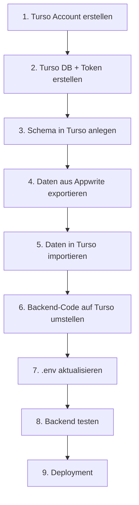

# Migrationsplan: Appwrite zu Turso (LibSQL)

## Übersicht

Die WGorganiser App soll von **Appwrite Cloud** auf **Turso** (LibSQL/SQLite) umgestellt werden. Grund: Appwrite pausiert nach 7 Tagen Inaktivität. Turso pausiert nie und bietet einen extrem großzügigen Free Tier (9 GB Storage, 1 Billion row reads/Monat).

## Warum Turso?

| Kriterium | Appwrite (aktuell) | Turso (neu) |
|---|---|---|
| **Pausiert bei Inaktivität?** | Ja, nach 7 Tagen | **Nein** |
| **Free Tier** | Begrenzt | 9 GB, 1B row reads |
| **DB-Typ** | PostgreSQL (BaaS) | LibSQL (SQLite-kompatibel) |
| **Python-Treiber** | `appwrite` SDK | `libsql-experimental` |
| **Kosten** | Kostenlos (aber Pausier-Problem) | Kostenlos |

## Aktuelle Datenstruktur (Appwrite)

### 6 Collections → 6 SQL-Tabellen

| Appwrite Collection | SQL-Tabelle | Besondere Felder |
|---|---|---|
| `stays` | `stays` | `checklist_in`, `checklist_out` (JSON-Strings) |
| `manuals` | `manuals` | `steps`, `image_data` (große Texte) |
| `messages` | `messages` | `replies` (JSON-String) |
| `events` | `events` | `hashtags` (JSON-String) |
| `berlin_links` | `berlin_links` | `hashtags` (JSON-String) |
| `settings` | `settings` | `rooms`, `checkin_template`, `checkout_template` (JSON-Strings) |

**Wichtig:** In Appwrite werden Arrays/Objekte als JSON-serialisierte Strings gespeichert. In Turso (SQLite) machen wir das genauso - JSON-Strings in TEXT-Spalten. Kein Datenmodell-Change nötig.

## Turso-Schema (SQL)

```sql
-- Stays
CREATE TABLE IF NOT EXISTS stays (
    id TEXT PRIMARY KEY,
    room TEXT NOT NULL,
    occupant_name TEXT NOT NULL,
    start_date TEXT NOT NULL,
    end_date TEXT NOT NULL,
    notes TEXT DEFAULT '',
    checklist_in TEXT DEFAULT '[]',
    checklist_out TEXT DEFAULT '[]',
    created_at TEXT,
    updated_at TEXT
);

-- Manuals
CREATE TABLE IF NOT EXISTS manuals (
    id TEXT PRIMARY KEY,
    title TEXT NOT NULL,
    description TEXT NOT NULL,
    steps TEXT NOT NULL,
    image_url TEXT,
    image_data TEXT,
    created_at TEXT,
    updated_at TEXT
);

-- Messages
CREATE TABLE IF NOT EXISTS messages (
    id TEXT PRIMARY KEY,
    name TEXT NOT NULL,
    content TEXT NOT NULL,
    created_at TEXT,
    replies TEXT DEFAULT '[]'
);

-- Events
CREATE TABLE IF NOT EXISTS events (
    id TEXT PRIMARY KEY,
    title TEXT NOT NULL,
    date TEXT NOT NULL,
    location TEXT NOT NULL,
    description TEXT NOT NULL,
    hashtags TEXT DEFAULT '[]',
    created_at TEXT
);

-- Berlin Links
CREATE TABLE IF NOT EXISTS berlin_links (
    id TEXT PRIMARY KEY,
    url TEXT NOT NULL,
    description TEXT NOT NULL,
    hashtags TEXT DEFAULT '[]',
    created_at TEXT
);

-- Settings
CREATE TABLE IF NOT EXISTS settings (
    id TEXT PRIMARY KEY,
    rooms TEXT DEFAULT '[]',
    checkin_template TEXT DEFAULT '[]',
    checkout_template TEXT DEFAULT '[]',
    plantsWateredAt TEXT,
    updated_at TEXT
);
```

## Technische Änderungen

### 1. Dependencies (requirements.txt)

```diff
  fastapi==0.110.1
  uvicorn==0.25.0
- appwrite>=2.0.0
+ libsql-experimental>=0.0.41
  python-dotenv>=1.0.1
  pydantic>=2.6.4
  email-validator>=2.2.0
  python-multipart>=0.0.9
```

### 2. Umgebungsvariablen (.env)

```diff
- APPWRITE_ENDPOINT=https://fra.cloud.appwrite.io/v1
- APPWRITE_PROJECT_ID=698ee816003631ef3d09
- APPWRITE_API_KEY=...
- APPWRITE_DATABASE_ID=wg-organiser
+ TURSO_DATABASE_URL=libsql://<db-name>-<org>.turso.io
+ TURSO_AUTH_TOKEN=<token>
```

### 3. Backend-Code (server.py)

**Was sich ändert:**
- Appwrite Client → Turso Connection (`libsql.connect()`)
- `db_service.list_documents()` → `cursor.execute("SELECT * FROM ...")`
- `db_service.create_document()` → `cursor.execute("INSERT INTO ...")`
- `db_service.get_document()` → `cursor.execute("SELECT * FROM ... WHERE id = ?")`
- `db_service.update_document()` → `cursor.execute("UPDATE ... SET ... WHERE id = ?")`
- `db_service.delete_document()` → `cursor.execute("DELETE FROM ... WHERE id = ?")`
- `doc_to_*()` Helper → **Entfallen** (Daten kommen bereits als Dicts aus SQLite)

**Was gleich bleibt:**
- Alle Pydantic-Modelle (Stay, Manual, Message, Event, BerlinLink, Settings)
- Alle API-Endpunkte (`/api/stays`, `/api/manuals`, etc.)
- Alle Request/Response-Modelle
- CORS-Konfiguration
- JSON-Serialisierung für Array-Felder

### 4. Frontend

**Keine Änderung nötig.** Alle API-Endpunkte bleiben identisch.

## Migrations-Schritte (Reihenfolge)



### Schritt 1: Turso Account & CLI

```bash
# Turso CLI installieren
curl -sSfL https://get.tur.so/install.sh | bash

# Einloggen
turso auth login

# Datenbank erstellen
turso db create wg-organiser

# Auth-Token erstellen
turso db tokens create wg-organiser
```

### Schritt 2: Schema anlegen

```bash
# Schema-Datei ausführen
turso db shell wg-organiser < backend/schema.sql
```

### Schritt 3: Daten migrieren

```bash
# Export aus Appwrite + Import in Turso (ein Skript)
python backend/migrate_appwrite_to_turso.py
```

### Schritt 4: Backend umstellen

```bash
# requirements.txt aktualisieren
pip install -r backend/requirements.txt

# .env aktualisieren (Turso-Credentials eintragen)

# Backend starten
uvicorn backend.server:app --reload
```

### Schritt 5: Verifizieren

Alle API-Endpunkte testen:
- `GET /api/stays` → Alle Aufenthalte
- `POST /api/stays` → Neuer Aufenthalt
- `GET /api/manuals` → Alle Anleitungen
- `GET /api/messages` → Alle Nachrichten
- `GET /api/events` → Alle Events
- `GET /api/berlin-links` → Alle Links
- `GET /api/settings` → Einstellungen
- `PUT /api/settings` → Einstellungen aktualisieren

## Dateien die geändert/erstellt werden

| Datei | Aktion | Beschreibung |
|---|---|---|
| `backend/schema.sql` | **Neu** | Turso-SQL-Schema |
| `backend/migrate_appwrite_to_turso.py` | **Neu** | Datenexport aus Appwrite + Import in Turso |
| `backend/server.py` | **Ändern** | Appwrite SDK → libsql-Treiber |
| `backend/requirements.txt` | **Ändern** | `appwrite` → `libsql-experimental` |
| `backend/.env` | **Ändern** | Turso-Credentials |
| `backend/setup_appwrite.py` | **Ersetzen** | Durch `backend/setup_turso.py` |
| `backend/fix_stays.py` | **Entfernen** | Nicht mehr nötig |

## Risiko & Rollback

- **Rollback:** Einfach - altes `server.py` mit Appwrite wiederherstellen, `.env` zurücksetzen
- **Datenverlust:** Kein Risiko - Appwrite-Daten bleiben während der Migration unberührt
- **Downtime:** Minimal - nur während des Deployment-Wechsels (~5 Minuten)

## Zeitschätzung

| Schritt | Dauer |
|---|---|
| Turso Account + DB erstellen | 10 Min |
| Schema anlegen | 5 Min |
| Migrationsskript ausführen | 5 Min |
| Backend-Code umstellen | 30 Min |
| Testen | 15 Min |
| Deployment | 10 Min |
| **Gesamt** | **~75 Min** |
